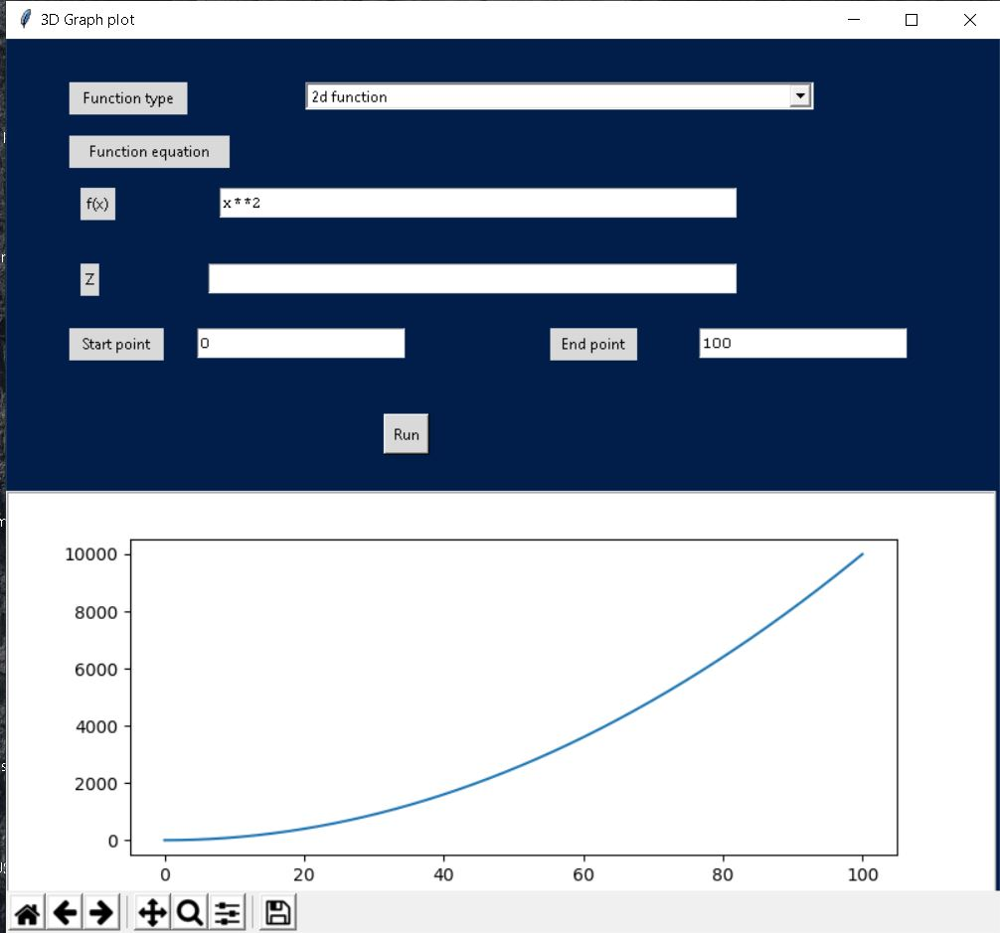
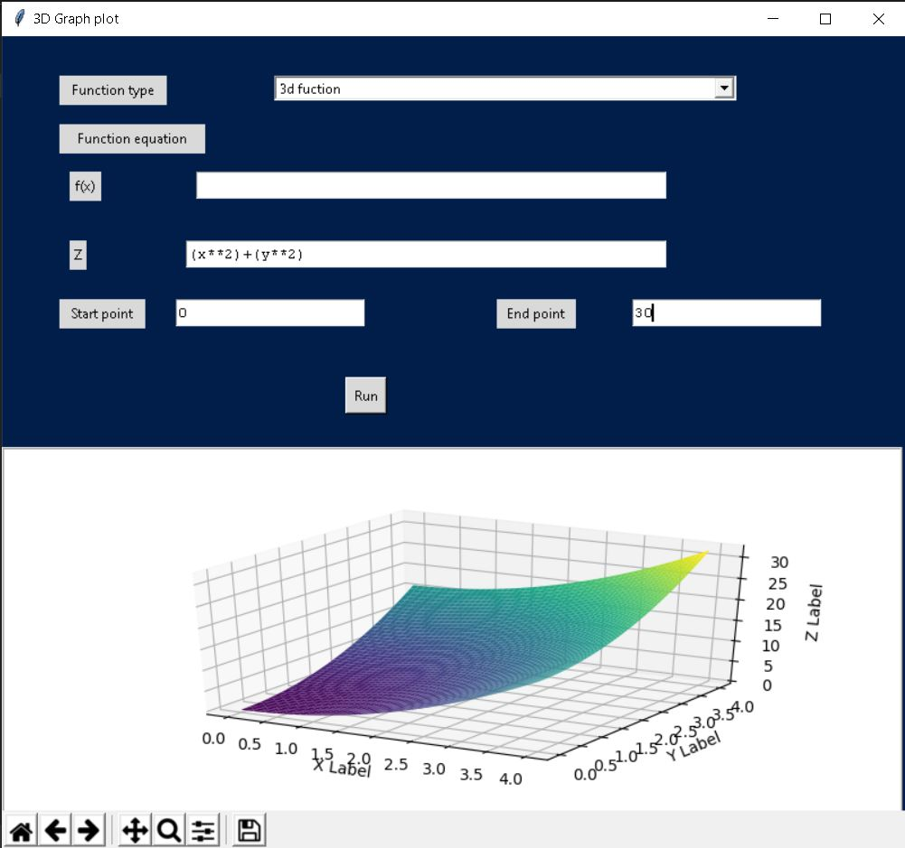

# 3D-graph-plotter

It is a graph plotting application for for desktop.It is made completely in python.

It can work as a nice project for python training.
 

To enter any mathematical function we need to use specific type such as below:

** for ^ or power operation

* for multiplication

/ for divion

+ for addition

- for substraction

I suggest usage of braces for large expressions.
<h3>This is a plot of 2d graph</h3> 

<h3> This is a plot for a 3d graph in the given format.</h3>

